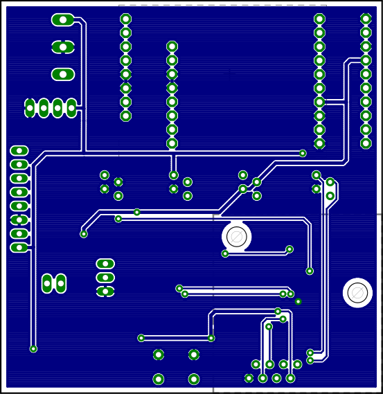

Isfar - a Hybrid-ROV underwater robot
=====================================

.. image:: isfar.png
    :width: 500pt

+---+-------------+---+--------------------+---+----------------------------------+
| 1 | main hull   | 4 | main drive         | 7 | environmnental measurements unit |
+---+-------------+---+--------------------+---+----------------------------------+
| 2 | side hull   | 5 | maneouvering drive | 8 | onboard vision system            |
+---+-------------+---+--------------------+---+----------------------------------+
| 3 | steel frame | 6 | buoyancy drive     | 9 | LED lighting                     |
+---+-------------+---+--------------------+---+----------------------------------+

Boards: mainboard
-----------------

Boards: sidedriver
------------------

Boards: trinocular/rpicam
-------------------------

